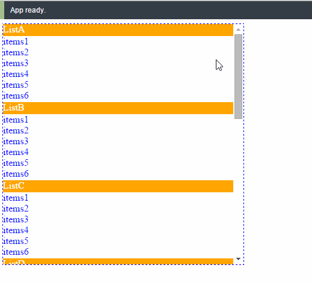

# React expandable listview
[](https://gitter.im/cht8687/help)

<big><h1 align="center">React expandable listview</h1></big>

<p align="center">
  <a href="https://circleci.com/gh/cht8687/react-expandable-listview">
    
  </a>

  <a href="https://www.npmjs.com/package/react-expandable-listview">
    
  </a>

 <a href="https://coveralls.io/github/cht8687/react-expandable-listview?branch=master">
    
 </a>

  <a href="https://travis-ci.org/cht8687/react-expandable-listview">
    
  </a>

  <a href="https://npmjs.org/package/react-expandable-listview">
    
  </a>

  <a href="https://david-dm.org/cht8687/react-expandable-listview.svg">
    
  </a>

  <a href="https://github.com/cht8687/react-expandable-listview/blob/master/LICENSE">
    
  </a>
</p>

<p align="center"><big>

</big></p>




## Philosophy

>You don't need jQuery to do this...

## Installation

### npm

```
$ npm install --save react-expandable-listview
```


## Demo

[http://cht8687.github.io/react-expandable-listview/example/](http://cht8687.github.io/react-expandable-listview/example/)

## Example Code

[https://github.com/cht8687/react-expandable-listview/tree/master/src/example](https://github.com/cht8687/react-expandable-listview/tree/master/src/example)

## API

#### &lt;ReactExpandableListView />

```js
<ReactExpandableListView 
        data={data} 
        headerAttName="headerName"
        itemsAttName="items" 
      />
```

The component accepts three props.

#### `data`: PropTypes.array.isRequired

```js
const DATALIST = [
{
    headerName : "ListG",
    isOpened: true,
    items : [{
      title : "items1"
    }, {
      title : "items2"
    }, {
      title : "items3"
    },{
      title : "items4"
    },{
      title : "items5"
    },{
      title : "items6"
    }],
    height: 100
  },{
    headerName : "ListH",
    isOpened: true,
    items : [{
      title : "items1"
    }, {
      title : "items2"
    }, {
      title : "items3"
    }],
    height: 100
  }
];
```

Note `height` varible defines the height you want each list to be like.
You can set different height data to suit the content of each section.

#### `headerAttName`: PropTypes.string.isRequired

Variable name of header in your `data` object.
In above example, it's `headerName`.

#### `itemsAttName`: PropTypes.string.isRequired

Variable name which hold items data in your `data` object.
In above example, it's `items`.


## Styling

The CSS is flexible, commented and made to be easily customized.

There is an CSS file in the root level you can include it in your project.
[CSS code](https://github.com/cht8687/react-expandable-listview/tree/master/react-expandable-listview.css).


## Development

```
$ git clone https://github.com/cht8687/react-expandable-listview.git
$ cd react-expandable-listview
$ npm install
$ webpack-dev-server
```

Then

```
open http://localhost:8080/webpack-dev-server/
```

## License

MIT

[](https://github.com/feross/standard)
